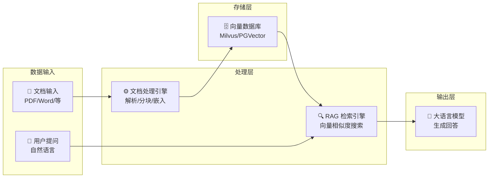

# 本地知识库搭建指南

## 概述

本地知识库（Local Knowledge Base）是企业 AI 应用的核心基础设施。通过将企业私有文档、数据转化为可检索的知识，结合大语言模型的理解能力，实现智能问答、文档分析、知识挖掘等功能。

## 核心架构



## 环境准备

### 系统要求

- **CPU**: 4核及以上
- **内存**: 16GB 及以上
- **存储**: 100GB SSD 及以上
- **GPU**: 可选，推荐用于 Embedding 加速

### 依赖安装

```bash
# Python 环境
python -m pip install langchain langchain-community

# 向量数据库
pip install pymilvus  # 或 pgvector

# 文档解析
pip install pypdf unstructured

# Embedding 模型
pip install sentence-transformers
```

## 快速开始

### 1. 初始化向量数据库

使用 Milvus 作为向量存储：

```bash
# Docker 启动 Milvus
docker-compose -f milvus-standalone-docker-compose.yml up -d
```

或使用 PostgreSQL + pgvector：

```sql
-- 创建向量扩展
CREATE EXTENSION IF NOT EXISTS vector;

-- 创建知识库表
CREATE TABLE knowledge_base (
    id SERIAL PRIMARY KEY,
    content TEXT,
    embedding VECTOR(768),
    metadata JSONB,
    created_at TIMESTAMP DEFAULT CURRENT_TIMESTAMP
);
```

### 2. 文档处理流程

```python
from langchain.document_loaders import PyPDFLoader, DirectoryLoader
from langchain.text_splitter import RecursiveCharacterTextSplitter
from langchain.embeddings import HuggingFaceEmbeddings
from langchain.vectorstores import Milvus

# 加载文档
loader = DirectoryLoader(
    "./documents",
    glob="**/*.pdf",
    loader_cls=PyPDFLoader
)
documents = loader.load()

# 文档分块
text_splitter = RecursiveCharacterTextSplitter(
    chunk_size=500,
    chunk_overlap=50,
    separators=["\n\n", "\n", "。", "；", " "]
)
chunks = text_splitter.split_documents(documents)

# 创建 Embedding
embeddings = HuggingFaceEmbeddings(
    model_name="BAAI/bge-large-zh-v1.5"
)

# 存入向量库
vector_store = Milvus.from_documents(
    documents=chunks,
    embedding=embeddings,
    connection_args={"host": "localhost", "port": "19530"},
    collection_name="company_knowledge"
)
```

### 3. 检索与问答

```python
from langchain.chains import RetrievalQA
from langchain.llms import OpenAI

# 创建检索器
retriever = vector_store.as_retriever(
    search_type="similarity",
    search_kwargs={"k": 5}
)

# 构建 RAG 链
qa_chain = RetrievalQA.from_chain_type(
    llm=OpenAI(),
    chain_type="stuff",
    retriever=retriever,
    return_source_documents=True
)

# 提问
result = qa_chain({"query": "公司的年假政策是什么？"})
print(result["result"])
```

## 高级配置

### 混合检索策略

结合向量检索与关键词检索，提升准确性：

```python
from langchain.retrievers import BM25Retriever, EnsembleRetriever

# BM25 关键词检索
bm25_retriever = BM25Retriever.from_documents(chunks)
bm25_retriever.k = 5

# 向量检索
vector_retriever = vector_store.as_retriever(search_kwargs={"k": 5})

# 融合检索
ensemble_retriever = EnsembleRetriever(
    retrievers=[bm25_retriever, vector_retriever],
    weights=[0.3, 0.7]
)
```

### 重排序优化

使用重排序模型提升检索质量：

```python
from langchain.retrievers import ContextualCompressionRetriever
from langchain.retrievers.document_compressors import CrossEncoderReranker

# 重排序模型
reranker = CrossEncoderReranker(model="BAAI/bge-reranker-large")

# 压缩检索器
compression_retriever = ContextualCompressionRetriever(
    base_compressor=reranker,
    base_retriever=vector_retriever
)
```

### 多租户隔离

企业场景下的数据隔离方案：

```python
# 为每个租户创建独立 Collection
from pymilvus import Collection, FieldSchema, CollectionSchema, DataType

def create_tenant_collection(tenant_id):
    fields = [
        FieldSchema(name="id", dtype=DataType.INT64, is_primary=True),
        FieldSchema(name="content", dtype=DataType.VARCHAR, max_length=65535),
        FieldSchema(name="embedding", dtype=DataType.FLOAT_VECTOR, dim=768),
        FieldSchema(name="metadata", dtype=DataType.JSON),
        FieldSchema(name="tenant_id", dtype=DataType.VARCHAR, max_length=64)
    ]
    
    schema = CollectionSchema(fields)
    collection = Collection(f"knowledge_{tenant_id}", schema)
    
    # 创建索引
    index_params = {
        "metric_type": "COSINE",
        "index_type": "IVF_FLAT",
        "params": {"nlist": 1024}
    }
    collection.create_index("embedding", index_params)
    return collection
```

## 性能优化

### 1. Embedding 模型选择

| 模型 | 维度 | 语言 | 适用场景 |
|------|------|------|----------|
| BAAI/bge-large-zh | 1024 | 中文 | 通用中文场景 |
| BAAI/bge-m3 | 1024 | 多语言 | 多语言混合 |
| text-embedding-3 | 1536 | 多语言 | OpenAI 生态 |
| m3e-base | 768 | 中文 | 轻量级应用 |

### 2. 分块策略优化

```python
# 按语义分块
from langchain.text_splitter import SemanticChunker

semantic_splitter = SemanticChunker(
    embeddings,
    breakpoint_threshold_type="percentile",
    breakpoint_threshold_amount=95
)

# 按结构分块（Markdown）
from langchain.text_splitter import MarkdownHeaderTextSplitter

markdown_splitter = MarkdownHeaderTextSplitter(
    headers_to_split_on=[("#", "Header 1"), ("##", "Header 2")]
)
```

### 3. 缓存策略

```python
from langchain.cache import InMemoryCache
import langchain

# 启用缓存
langchain.llm_cache = InMemoryCache()

# 或使用 Redis 缓存
from langchain.cache import RedisCache
import redis

redis_client = redis.Redis(host='localhost', port=6379)
langchain.llm_cache = RedisCache(redis_client)
```

## 安全与隐私

### 数据脱敏

```python
import re

def desensitize_text(text):
    # 手机号脱敏
    text = re.sub(r'1[3-9]\d{9}', lambda m: m.group()[:3] + '****' + m.group()[7:], text)
    # 身份证号脱敏
    text = re.sub(r'\d{17}[\dXx]', lambda m: m.group()[:6] + '********' + m.group()[14:], text)
    # 邮箱脱敏
    text = re.sub(r'(\w{2})\w+@(\w+)', r'\1***@\2', text)
    return text

# 处理前对文档进行脱敏
chunks = [desensitize_text(chunk) for chunk in chunks]
```

### 访问控制

```python
from functools import wraps

def require_permission(permission):
    def decorator(func):
        @wraps(func)
        def wrapper(user, *args, **kwargs):
            if permission not in user.permissions:
                raise PermissionError("Access denied")
            return func(user, *args, **kwargs)
        return wrapper
    return decorator

@require_permission("knowledge:read")
def query_knowledge_base(user, query):
    # 查询逻辑
    pass
```

## 最佳实践

### 文档预处理清单

- [ ] 扫描件需先 OCR 识别
- [ ] 去除页眉页脚和页码
- [ ] 表格内容转换为结构化数据
- [ ] 图片提取并添加描述
- [ ] 敏感信息脱敏处理

### 持续优化

1. **用户反馈收集**: 记录问答质量，标记错误回答
2. **增量更新**: 定期处理新增文档，无需全量重建
3. **监控指标**: 检索延迟、回答准确率、用户满意度
4. **A/B 测试**: 对比不同 Embedding 模型和参数效果

## 常见问题

### Q: 如何处理扫描版 PDF？

使用 OCR 工具预处理：

```python
import pytesseract
from pdf2image import convert_from_path

images = convert_from_path("scan.pdf")
text = "\n".join([pytesseract.image_to_string(img, lang='chi_sim+eng') for img in images])
```

### Q: 知识库更新如何增量处理？

```python
# 计算文档指纹
import hashlib

def get_doc_fingerprint(filepath):
    with open(filepath, 'rb') as f:
        return hashlib.md5(f.read()).hexdigest()

# 只处理新增或修改的文档
existing_ids = set(get_existing_ids())
new_docs = [doc for doc in all_docs if doc.id not in existing_ids]
```

### Q: 如何处理超长文档？

采用分层摘要策略：
1. 段落级摘要
2. 章节级摘要  
3. 文档级摘要
4. 构建树状索引结构

## 总结

本地知识库是企业 AI 应用的基础设施，通过合理的架构设计、性能优化和安全策略，可以构建高效、可靠的智能知识管理系统。

如需技术支持，请通过以下方式联系我们：
- 邮箱：c@m9ai.work
- 官网：https://m9ai.work
