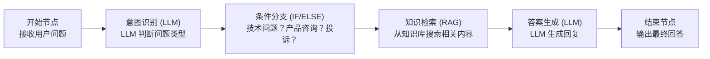

# AI 工作流搭建实战

## 概述

AI 工作流（AI Workflow）是将大语言模型与业务流程相结合的自动化系统。通过可视化的流程编排工具，无需编写代码即可构建复杂的 AI 应用。

## 常见工作流类型

| 类型 | 应用场景 | 典型工具 |
|------|----------|----------|
| 内容生成 | 文章写作、营销文案 | Dify、Coze |
| 数据处理 | 文档分析、信息提取 | LangFlow、Flowise |
| 客服自动化 | 智能问答、工单处理 | Dify、FastGPT |
| 代码辅助 | 代码生成、Code Review | Continue、Cursor |

## Dify 快速入门

### 环境部署

**Docker 部署（推荐）**

```bash
# 克隆仓库
git clone https://github.com/langgenius/dify.git
cd dify/docker

# 启动服务
docker-compose up -d

# 访问 http://localhost/install 完成初始化
```

**本地开发环境**

```bash
# 后端
cd api
poetry install
poetry shell
flask db upgrade
flask run --host 0.0.0.0 --port 5001

# 前端
cd web
npm install
npm run dev
```

### 第一个工作流：智能客服

#### 步骤 1: 创建应用

1. 登录 Dify 控制台
2. 点击「创建应用」→「工作流编排」
3. 命名：智能客服助手

#### 步骤 2: 设计流程



#### 步骤 3: 配置节点

**意图识别节点配置：**

```json
{
  "model": "gpt-4",
  "temperature": 0.3,
  "system_prompt": "你是一个客服意图识别专家。请分析用户问题，判断意图类型：\n1. technical - 技术问题\n2. product - 产品咨询\n3. complaint - 投诉建议\n4. other - 其他\n\n只输出意图类型，不要解释。",
  "user_prompt": "用户问题：{{#start.user_input#}}"
}
```

**知识检索节点配置：**

```json
{
  "knowledge_base": "产品知识库",
  "retrieval_mode": "semantic",
  "top_k": 3,
  "score_threshold": 0.7
}
```

**答案生成节点配置：**

```json
{
  "model": "gpt-4",
  "temperature": 0.7,
  "system_prompt": "你是专业客服助手。基于检索到的知识回答用户问题。如果知识不足，礼貌地告知用户需要转人工。",
  "user_prompt": "用户问题：{{#start.user_input#}}\n\n相关知识：{{#retrieval.result#}}"
}
```

### 进阶工作流：内容生成流水线

#### 场景描述

自动生成一篇完整的公众号文章：选题 → 大纲 → 正文 → 配图建议 → 标题优化

#### 流程设计

```yaml
workflow:
  name: 公众号文章生成器
  
  nodes:
    - id: start
      type: start
      inputs:
        - name: topic
          type: text
          label: 文章主题
    
    - id: research
      type: http-request
      config:
        url: "https://api.example.com/trending"
        method: GET
        params:
          keyword: "{{#start.topic#}}"
      
    - id: outline
      type: llm
      config:
        model: claude-3-opus
        prompt: |
          基于主题「{{#start.topic#}}」和热点数据：
          {{#research.result#}}
          
          生成文章大纲，包含：
          1. 吸引人的标题（3个备选）
          2. 文章结构（引言-正文-结论）
          3. 每个部分的核心观点
    
    - id: content
      type: llm
      config:
        model: gpt-4
        prompt: |
          根据大纲撰写完整文章：
          {{#outline.result#}}
          
          要求：
          - 字数：1500-2000字
          - 风格：专业但易懂
          - 包含具体案例和数据
    
    - id: image-suggestions
      type: llm
      config:
        model: gpt-4-vision
        prompt: |
          为以下文章内容推荐配图：
          {{#content.result#}}
          
          每张图需说明：
          - 图片主题
          - 构图建议
          - 配色方案
    
    - id: title-optimize
      type: llm
      config:
        model: claude-3-haiku
        prompt: |
          优化以下标题，生成10个爆款标题选项：
          {{#outline.titles#}}
          
          优化方向：
          - 数字法则
          - 悬念设置
          - 情感共鸣
          - 实用性强调
    
    - id: end
      type: end
      outputs:
        - name: article
          value: "{{#content.result#}}"
        - name: titles
          value: "{{#title-optimize.result#}}"
        - name: images
          value: "{{#image-suggestions.result#}}"
```

## LangFlow 工作流搭建

### 安装部署

```bash
pip install langflow

# 启动
langflow run

# 访问 http://localhost:7860
```

### 搭建数据提取工作流

**场景：** 从合同 PDF 中提取关键信息

**组件清单：**

1. **File** - 上传 PDF 文件
2. **PDF Loader** - 解析文档内容
3. **Split Text** - 文档分块
4. **ChatOpenAI** - LLM 处理
5. **Prompt** - 提取提示词
6. **Output Parser** - JSON 格式化

**Prompt 配置：**

```json
从以下合同内容中提取信息，以 JSON 格式返回：

合同内容：
{document}

提取字段：
- 合同编号 (contract_no)
- 签约日期 (sign_date)
- 甲方名称 (party_a)
- 乙方名称 (party_b)
- 合同金额 (amount)
- 付款方式 (payment_terms)
- 服务期限 (service_period)
- 违约责任 (liability)

只返回 JSON，不要其他内容。
```

## 智能体（Agent）工作流

### ReAct 模式实现

ReAct（Reasoning + Acting）让 AI 能够思考并调用工具：

```python
from langchain.agents import Tool, AgentExecutor, create_react_agent
from langchain.prompts import PromptTemplate
from langchain.tools import DuckDuckGoSearchRun

# 定义工具
tools = [
    Tool(
        name="搜索",
        func=DuckDuckGoSearchRun().run,
        description="用于搜索实时信息"
    ),
    Tool(
        name="计算器",
        func=lambda x: eval(x),
        description="用于数学计算"
    ),
    Tool(
        name="数据库查询",
        func=query_database,
        description="用于查询企业数据库"
    )
]

# ReAct Prompt
template = """尽可能回答以下问题。你可以使用以下工具：

{tools}

请使用以下格式：

问题：你需要回答的问题
思考：你应该如何思考
行动：要采取的行动（必须是以下工具之一：{tool_names}）
行动输入：工具的输入
观察：行动的结果
...（这个思考/行动/行动输入/观察可以重复N次）
思考：我现在知道最终答案
最终答案：问题的最终答案

开始！

问题：{input}
思考：{agent_scratchpad}"""

prompt = PromptTemplate.from_template(template)

# 创建 Agent
agent = create_react_agent(llm, tools, prompt)
agent_executor = AgentExecutor(agent=agent, tools=tools, verbose=True)

# 运行
result = agent_executor.invoke({
    "input": "帮我查一下今天北京的天气，然后计算一下如果温度是25度，华氏度是多少？"
})
```

### 多 Agent 协作系统

```python
from langchain.agents import AgentType, initialize_agent
from langchain.schema import SystemMessage

# 研究员 Agent
researcher = initialize_agent(
    tools=[search_tool, arxiv_tool],
    llm=llm,
    agent=AgentType.OPENAI_FUNCTIONS,
    system_message=SystemMessage(content="你是研究员，负责收集和整理信息。"),
    verbose=True
)

# 写手 Agent
writer = initialize_agent(
    tools=[doc_tool],
    llm=llm,
    agent=AgentType.OPENAI_FUNCTIONS,
    system_message=SystemMessage(content="你是专业写手，负责撰写高质量文章。"),
    verbose=True
)

# 编辑 Agent
editor = initialize_agent(
    tools=[grammar_tool],
    llm=llm,
    agent=AgentType.OPENAI_FUNCTIONS,
    system_message=SystemMessage(content="你是资深编辑，负责审核和修改文章。"),
    verbose=True
)

# 协作流程
def collaborative_workflow(topic):
    # 1. 研究
    research = researcher.run(f"搜集关于'{topic}'的最新资料和数据")
    
    # 2. 写作
    draft = writer.run(f"基于以下资料撰写文章：\n{research}")
    
    # 3. 编辑
    final = editor.run(f"审核并优化以下文章：\n{draft}")
    
    return final
```

## 工作流编排最佳实践

### 1. 错误处理

```yaml
- id: main_task
  type: llm
  fallback:
    - id: fallback_model
      type: llm
      config:
        model: gpt-3.5-turbo  # 降级模型
  on_error: continue  # 继续执行后续节点
```

### 2. 并行处理

```yaml
- id: parallel_analysis
  type: parallel
  branches:
    - id: sentiment
      type: llm
      config:
        prompt: "分析情感：{{#input.text#}}"
    - id: keywords
      type: llm
      config:
        prompt: "提取关键词：{{#input.text#}}"
    - id: summary
      type: llm
      config:
        prompt: "生成摘要：{{#input.text#}}"
  merge_strategy: all  # 等待所有分支完成
```

### 3. 人工审核节点

```yaml
- id: human_review
  type: human-in-the-loop
  config:
    assignee: "manager"
    timeout: 3600  # 1小时超时
    fallback_action: "reject"
  inputs:
    - name: content
      value: "{{#llm.output#}}"
```

### 4. 缓存策略

```python
# 工作流级别缓存
@workflow.cache(ttl=3600)
def expensive_operation(input_data):
    # 耗时操作
    return result

# 节点级别缓存
- id: cached_node
  type: llm
  cache:
    enabled: true
    key: "{{#input.topic#}}"
    ttl: 7200
```

## 性能优化

### 1. 模型选择策略

```python
# 简单任务使用轻量级模型
if task_complexity < 0.5:
    model = "gpt-3.5-turbo"
else:
    model = "gpt-4"

# 动态温度设置
if task_type == "creative":
    temperature = 0.8
else:
    temperature = 0.2
```

### 2. 流式输出

```python
# Dify API 流式调用
import requests

def stream_workflow(query):
    response = requests.post(
        "http://localhost/v1/workflows/run",
        json={
            "inputs": {"query": query},
            "response_mode": "streaming",
            "user": "user-123"
        },
        stream=True
    )
    
    for line in response.iter_lines():
        if line:
            yield json.loads(line)

# 使用
for chunk in stream_workflow("帮我写一首诗"):
    print(chunk.get("answer", ""), end="")
```

### 3. 批量处理

```python
from concurrent.futures import ThreadPoolExecutor

def batch_process(items, workflow, max_workers=5):
    with ThreadPoolExecutor(max_workers=max_workers) as executor:
        futures = [
            executor.submit(workflow.run, item)
            for item in items
        ]
        results = [f.result() for f in futures]
    return results
```

## 监控与调试

### 1. 日志追踪

```python
import logging

logging.basicConfig(
    level=logging.INFO,
    format='%(asctime)s - %(name)s - %(levelname)s - %(message)s'
)

logger = logging.getLogger(__name__)

@workflow.trace()
def my_node(inputs):
    logger.info(f"Processing inputs: {inputs}")
    result = process(inputs)
    logger.info(f"Generated output: {result}")
    return result
```

### 2. 可视化调试

Dify 和 LangFlow 都提供可视化调试功能：

- **节点状态查看**: 每个节点的输入输出
- **执行时间分析**: 识别性能瓶颈
- **变量追踪**: 查看数据流变化
- **重试运行**: 从失败节点重新执行

## 总结

AI 工作流是实现业务自动化的有效方式，通过可视化的编排工具，非技术人员也能构建强大的 AI 应用。关键要点：

1. **模块化设计**: 将复杂流程拆分为独立节点
2. **错误处理**: 设计降级策略和重试机制
3. **性能优化**: 合理选择模型，使用缓存和并行
4. **持续迭代**: 基于反馈不断优化提示词和流程

如需进一步支持，请联系我们：
- 邮箱：c@m9ai.work
- 官网：https://m9ai.work
